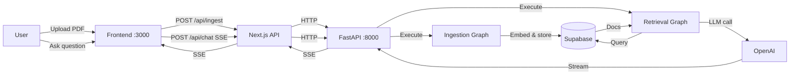
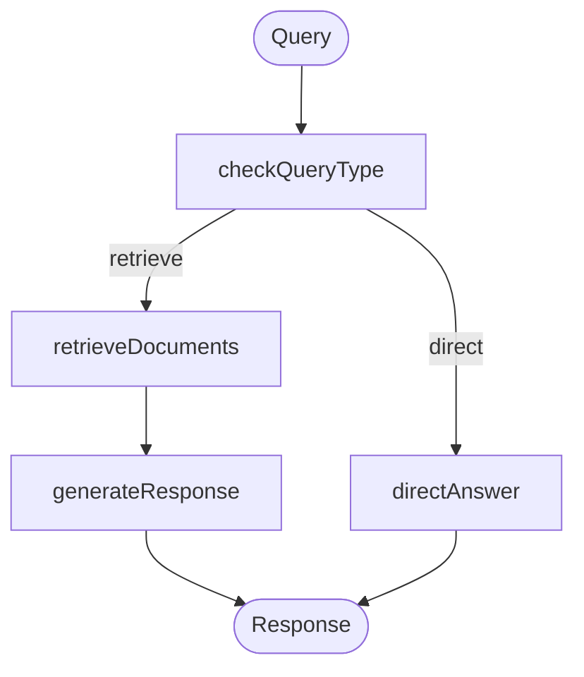

# AI PDF Chatbot

FastAPI + LangGraph RAG chatbot that ingests PDFs into Supabase vector store and answers queries using OpenAI.

## Table of Contents

1. [Features](#features)
2. [Quick Start](#quick-start)
3. [Architecture](#architecture)
4. [Project Structure](#project-structure)
5. [Configuration](#configuration)
6. [Running Locally](#running-locally)
7. [Database](#database)
8. [API](#api)
9. [Quality](#quality)
10. [CI/CD](#cicd)
11. [Security Notes](#security-notes)
12. [Troubleshooting](#troubleshooting)
13. [License](#license)

## Features

**AI-Powered Document Q&A**
- Upload multiple PDF files (up to 5 files, 10MB each) and ask questions about their content
- Intelligent query routing: Direct answers for simple questions, retrieval-augmented generation for document-specific queries
- Streaming responses for real-time conversational experience

**Built on Modern AI Stack**
- **FastAPI**: Production-ready HTTP server with automatic OpenAPI documentation
- **LangGraph State Graphs**: Two separate graphs for ingestion and retrieval workflows
- **Vector Search**: Supabase vector store with pgvector for semantic search
- **OpenAI Integration**: GPT-4o-mini for embeddings and response generation
- **LangSmith Tracing**: Optional observability for debugging and monitoring

**Developer Experience**
- Hot reload with FastAPI and Next.js dev mode
- Swagger UI at `/docs` for API exploration
- LangGraph Studio (optional) for visual graph debugging
- Comprehensive test suite with 90% coverage target
- Type safety with TypeScript and Python type hints

## Quick Start

**Prerequisites**: Node.js 18+, Python 3.11+, Poetry, Yarn, Supabase account, OpenAI API key

```bash
# 1. Clone and install
git clone https://github.com/mayooear/ai-document-assistant.git
cd ai-document-assistant
yarn install
cd backend && poetry install && cd ..

# 2. Configure backend
cp backend/.env.example backend/.env
# Edit backend/.env with your OPENAI_API_KEY, SUPABASE_URL, SUPABASE_SERVICE_ROLE_KEY

# 3. Configure frontend
cp frontend/.env.example frontend/.env.local
# Edit if needed (defaults work for local dev)

# 4. Set up Supabase
# Create table `documents` and function `match_documents` per:
# https://python.langchain.com/docs/integrations/vectorstores/supabase/

# 5. Start backend (terminal 1)
cd backend && poetry run uvicorn src.main:app --reload

# 6. Start frontend (terminal 2)
cd frontend && yarn dev

# 7. Open http://localhost:3000
```

## Architecture



**Components**
- **Frontend**: Next.js 14 React app with PDF upload and chat UI
- **Backend**: FastAPI wrapping LangGraph execution
  - `ingestion_graph`: Processes PDFs → embeddings → Supabase
  - `retrieval_graph`: Routes query → retrieves docs → generates answer
- **Vector Store**: Supabase with `documents` table and `match_documents` function
- **LLM**: OpenAI GPT-4o-mini (configurable in `frontend/constants/graphConfigs.ts`)

**Retrieval Graph Flow**



## Project Structure

```
.
├── backend/
│   ├── src/
│   │   ├── main.py              # FastAPI application
│   │   ├── ingestion_graph/     # PDF indexing graph
│   │   │   ├── graph.py         # Graph: ingestDocs node
│   │   │   ├── state.py         # IndexState definition
│   │   │   └── configuration.py
│   │   ├── retrieval_graph/     # Q&A graph
│   │   │   ├── graph.py         # Graph: 4 nodes with routing
│   │   │   ├── state.py         # AgentState definition
│   │   │   ├── prompts.py       # Router & response prompts
│   │   │   ├── utils.py         # Doc formatting helpers
│   │   │   └── configuration.py
│   │   ├── shared/              # Shared utilities
│   │   │   ├── configuration.py # BaseConfiguration
│   │   │   ├── retrieval.py     # make_retriever factory
│   │   │   ├── state.py         # reduce_docs reducer
│   │   │   └── utils.py         # load_chat_model
│   │   └── sample_docs.json     # Demo data
│   ├── tests/                   # pytest suite (90% coverage target)
│   ├── pyproject.toml           # Poetry config
│   ├── langgraph.json           # Graph definitions (for LangGraph Studio)
│   └── Dockerfile               # Production image
├── frontend/
│   ├── app/
│   │   ├── api/
│   │   │   ├── ingest/route.ts  # PDF upload handler
│   │   │   └── chat/route.ts    # SSE streaming handler
│   │   ├── page.tsx             # Chat UI
│   │   └── layout.tsx
│   ├── components/              # React + shadcn/ui
│   ├── lib/
│   │   └── pdf.ts               # PDF parsing
│   └── constants/graphConfigs.ts # Graph defaults (model, k, provider)
└── .github/workflows/ci.yml     # CI: format + lint
```

## Configuration

**Environment Variables**

Backend (`.env` in `backend/`):

| Variable | Required | Description | Example |
|----------|----------|-------------|---------|
| OPENAI_API_KEY | Yes | OpenAI API key | sk-... |
| SUPABASE_URL | Yes | Supabase project URL | https://xxx.supabase.co |
| SUPABASE_SERVICE_ROLE_KEY | Yes | Supabase service role key | eyJh... |
| ALLOWED_ORIGINS | No | CORS allowed origins | http://localhost:3000 |
| LANGCHAIN_TRACING_V2 | No | Enable LangSmith tracing | true |
| LANGCHAIN_API_KEY | No | LangSmith API key | lsv2_... |
| LANGCHAIN_PROJECT | No | LangSmith project name | ai-pdf-chatbot |

Frontend (`.env.local` in `frontend/`):

| Variable | Required | Description | Default |
|----------|----------|-------------|---------|
| NEXT_PUBLIC_API_URL | No | FastAPI backend URL | http://127.0.0.1:8000 |
| LANGCHAIN_API_KEY | No | LangSmith API key | |
| LANGCHAIN_TRACING_V2 | No | Enable tracing | true |
| LANGCHAIN_PROJECT | No | Project name | AI-Document-Assistant |

**Ports and URLs**
- Backend FastAPI server: `http://localhost:8000`
- Frontend dev server: `http://localhost:3000`
- API Documentation (Swagger): `http://localhost:8000/docs`
- API Documentation (ReDoc): `http://localhost:8000/redoc`
- Health Check: `http://localhost:8000/health`
- LangGraph Studio (optional): `https://smith.langchain.com/studio/?baseUrl=http://127.0.0.1:2024`

## Running Locally

**Native (recommended for development)**

Terminal 1 - Backend:
```bash
cd backend
poetry install
poetry run uvicorn src.main:app --reload --host 0.0.0.0 --port 8000
```

Terminal 2 - Frontend:
```bash
cd frontend
yarn install
yarn dev
```

Access:
- Chat UI: http://localhost:3000
- API Docs: http://localhost:8000/docs
- Health Check: http://localhost:8000/health

**Optional: LangGraph Studio (for debugging graphs)**
```bash
cd backend
poetry run langgraph dev  # Runs on port 2024
# Open: https://smith.langchain.com/studio/?baseUrl=http://127.0.0.1:2024
```

**Docker (backend only)**

```bash
cd backend
docker build -t pdf-chatbot-backend .
docker run -p 8000:8000 --env-file .env pdf-chatbot-backend
```

Note: No docker-compose provided. Frontend deployment via Vercel/Netlify recommended.

## Database

**Supabase Setup**

Required table and function for vector search:

```sql
-- Enable pgvector extension
CREATE EXTENSION IF NOT EXISTS vector;

-- Table: documents
CREATE TABLE documents (
  id BIGSERIAL PRIMARY KEY,
  content TEXT,
  metadata JSONB,
  embedding VECTOR(1536)
);

-- Index for faster similarity search
CREATE INDEX ON documents USING ivfflat (embedding vector_cosine_ops)
WITH (lists = 100);

-- Function: match_documents
CREATE FUNCTION match_documents (
  query_embedding VECTOR(1536),
  match_count INT DEFAULT 5,
  filter JSONB DEFAULT '{}'::jsonb
) RETURNS TABLE (
  id BIGINT,
  content TEXT,
  metadata JSONB,
  similarity FLOAT
)
LANGUAGE plpgsql
AS $$
#variable_conflict use_column
BEGIN
  RETURN QUERY
  SELECT
    id,
    content,
    metadata,
    1 - (documents.embedding <=> query_embedding) AS similarity
  FROM documents
  WHERE metadata @> filter
  ORDER BY documents.embedding <=> query_embedding
  LIMIT match_count;
END;
$$;
```

For detailed setup: https://js.langchain.com/docs/integrations/vectorstores/supabase/

**Migrations**: None. Manual SQL setup required above.

**Seeding**: Use demo data via backend config `useSampleDocs: true` in `frontend/constants/graphConfigs.ts`

## API

**FastAPI Endpoints**

Base URL: `http://localhost:8000`

### Health Check
```bash
GET /health
```
Response: `{"status": "healthy", "version": "0.1.0"}`

### Upload PDFs
```bash
POST /api/ingest
Content-Type: multipart/form-data

Parameters:
- file: PDF file (required, max 10MB)
- threadId: string (required)
- config: JSON string (optional)

Response:
{
  "status": "success",
  "message": "Successfully ingested filename.pdf",
  "thread_id": "abc123",
  "result": "..."
}
```

### Chat Query
```bash
POST /api/chat
Content-Type: application/json

Body:
{
  "message": "What is the main topic?",
  "threadId": "abc123",
  "config": {
    "configurable": {
      "queryModel": "openai/gpt-4o-mini",
      "retrieverProvider": "supabase",
      "k": 5
    }
  }
}

Response: Server-Sent Events (SSE) stream
data: {"event": "updates", "data": {...}}
```

**Next.js API Routes** (Frontend)

These proxy to FastAPI:
- `POST /api/ingest` → `http://localhost:8000/api/ingest`
- `POST /api/chat` → `http://localhost:8000/api/chat`

**Example: Upload PDF**

```bash
curl -X POST http://localhost:8000/api/ingest \
  -F "file=@document.pdf" \
  -F "threadId=test-123"
```

**Example: Ask Question**

```bash
curl -X POST http://localhost:8000/api/chat \
  -H "Content-Type: application/json" \
  -d '{
    "message": "What is the main topic?",
    "threadId": "test-123"
  }' \
  -N
```

**OpenAPI Documentation**: Available at `http://localhost:8000/docs` (Swagger UI) and `http://localhost:8000/redoc` (ReDoc)

## Quality

**Linting and Formatting**

```bash
# Root (all workspaces)
yarn lint              # Check all
yarn lint:fix          # Fix all
yarn format            # Format all
yarn format:check      # Check format

# Backend
cd backend
poetry run ruff check .        # Lint
poetry run ruff check . --fix  # Fix
poetry run black .             # Format
poetry run mypy src            # Type check

# Frontend
cd frontend
yarn lint              # ESLint
yarn lint --fix        # Fix
```

**Testing**

```bash
# Backend
cd backend
poetry run pytest                    # All tests
poetry run pytest -m "not integration"  # Unit only
poetry run pytest --cov              # With coverage
poetry run pytest --cov-report=html  # HTML report

# Frontend
cd frontend
yarn test              # All tests
yarn test:watch        # Watch mode
```

**Pre-commit Hooks**: None configured. TODO: Add husky/lint-staged.

**Coverage Targets**
- Backend: 90% (enforced in pytest config)
- Frontend: No target set

## CI/CD

**GitHub Actions** (`.github/workflows/ci.yml`)

Runs on: Push to main, PRs, manual trigger

Jobs:
1. **format** - Checks code formatting with `yarn format:check`
2. **lint** - Lints code with `yarn run lint:all`

**Missing**:
- Test execution (pytest and jest)
- Backend validation
- Deployment workflow

**Deploy Backend**

Option 1 - Docker:
```bash
cd backend
docker build -t pdf-chatbot .
docker push your-registry/pdf-chatbot
# Deploy to your infrastructure (AWS ECS, GCP Cloud Run, etc.)
```

Option 2 - LangGraph Cloud (optional):
```bash
# Follow: https://langchain-ai.github.io/langgraph/cloud/quick_start/
```

**Deploy Frontend**

Vercel (recommended):
```bash
cd frontend
vercel --prod
```

Set env vars in Vercel dashboard:
- `NEXT_PUBLIC_API_URL` = your deployed FastAPI URL (e.g., https://api.yourdomain.com)
- `LANGCHAIN_API_KEY` = your LangSmith API key (optional)
- `LANGCHAIN_TRACING_V2` = true (optional)
- `LANGCHAIN_PROJECT` = your project name (optional)

## Security Notes

- **Authentication**: None. `/api/ingest` and `/api/chat` are public endpoints.
- **CORS**: Configured in FastAPI to allow frontend origins (see `ALLOWED_ORIGINS` in backend .env)
- **Rate Limiting**: None. Add rate-limiting middleware before production.
- **API Keys**: Stored in `.env` files. Never commit `.env` to git.
- **File Upload**: Limited to 5 PDFs, 10MB each (configurable in `src/main.py`)
- **Secrets**: LangChain API key is optional but recommended for debugging.

TODO: Add authentication (e.g., JWT) and rate limiting (e.g., slowapi) to FastAPI.

## Troubleshooting

**1. `OPENAI_API_KEY not set`**
```
Error: OpenAI API key not found
Fix: Copy backend/.env.example to backend/.env and add your key
```

**2. `SUPABASE_URL or SUPABASE_SERVICE_ROLE_KEY not defined`**
```
Error: Supabase credentials missing
Fix: Add SUPABASE_URL and SUPABASE_SERVICE_ROLE_KEY to backend/.env
Check: Verify credentials at https://app.supabase.com/project/_/settings/api
```

**3. `match_documents function does not exist`**
```
Error: function match_documents(vector, integer, jsonb) does not exist
Fix: Run the SQL from "Database" section above in Supabase SQL editor
```

**4. `poetry: command not found`**
```
Error: poetry not installed
Fix: Install Poetry: curl -sSL https://install.python-poetry.org | python3 -
     Or: brew install poetry (macOS)
```

**5. `poetry.lock` out of sync**
```
Error: pyproject.toml changed significantly since poetry.lock was last generated
Fix: cd backend && poetry lock && poetry install
```

**6. `Port 8000 already in use`**
```
Error: Address already in use
Fix: Kill process: lsof -ti:8000 | xargs kill -9
     Or: Change port: uvicorn src.main:app --port 8001
```

**7. Frontend can't connect to backend**
```
Error: Failed to fetch from http://localhost:8000
Fix: Ensure backend is running (poetry run uvicorn src.main:app --reload)
     Verify NEXT_PUBLIC_API_URL in frontend/.env.local
     Check FastAPI logs for errors
```

**8. PDF upload fails silently**
```
Error: No documents extracted
Fix: Check PDF is not encrypted or image-only
     Check backend logs for errors
     Verify file size < 10MB
     Check FastAPI logs: Look for ingestion errors
```

**9. Tests fail with import errors**
```
Error: ModuleNotFoundError: No module named 'src'
Fix: Run from backend/ directory: poetry run pytest
     Ensure poetry install was successful
```

**10. `yarn install` fails**
```
Error: Integrity check failed
Fix: Delete node_modules and yarn.lock, then yarn install
     Or: yarn install --ignore-engines
```

**11. Chat responses not appearing in UI**
```
Error: Messages stream but don't display
Fix: Check browser console for SSE parsing errors
     Verify backend sends correct event format
     Check network tab for streaming response
```

**12. `uvicorn: command not found`**
```
Error: Command not found: uvicorn
Fix: cd backend && poetry install
     Ensure uvicorn is in pyproject.toml dependencies
```

## License

MIT License - See LICENSE file
